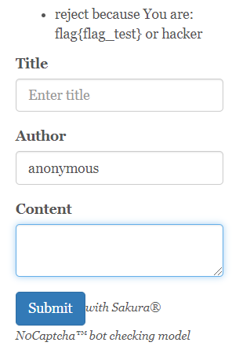

## 题目信息：

* 题目名称： a_msg_board_plus_
* 预估难度：中等


## 题目描述：
```
这是个环境为 Ubuntu, Python 3.6 、还带了乐色消息和嗨客识别的爱马杀鸡宝德加
```

## 题目考点：
```
1. Jinja2模板注入（SSTI）
2. Flask session机制
3. TensorFlow模型审计（相比区域赛添加新步骤）
```

## 思路简述：
通过留言板的模版注入获取到服务器配置信息，通过配置中的secret_key伪造session成为管理员，再利用站点设置选项的TensorFlow相关设置，取得模型内的后门，读取 `/flag` 文件。~~论不要随便乱跑网上下载来的模型~~


## 题目提示（难度从低到高）：
1. SSTI
2. Flask Session，注意时间戳
3. 出题人也不知道TensorFlow模型是从哪来的


## 原始 flag 及更新命令：

```shell
    # 原始 flag
    flag{flag_test}
    # ..
    # 更新 flag 命令
    echo 'flag{85c2a01a-55f7-442a-8712-3f6908e1463a}' > /flag
```


## 题目环境：
```
1. ubuntu 14.04 LTS（更新到最新）
2. Python 3.6 
```

## 题目writeup：
1. 进入网站，为一个留言板服务，并且带有机器人过滤机制，页面底部有一个管理员入口但无法进入。

2. 留言的作者存在SSTI，但有位数限制不能使用长payload

   

3. 使用`{{config}}`获取服务器配置信息，其中泄露了`SECRET_KEY`
   
   
4. 观察Flask的session（Flask的session存于cookies并且用`SECRET_KEY`签名）`{"admin":false,"name":"{{config}}"}`，可断定服务器通过session判断是否有管理员权限。

5. 通过前面获取到的`SECRET_KEY`来伪造`{"admin":true}`的session（本地生成一个Flask实例，通过该实例生成合法session，过程见gen_cookie.py）

   （后续步骤为相对于区域赛修改部分）

6. 登录管理员后可以进入`/admin`后台，其中后台提供了网站源码和TensorFlow模型上传，并且从网页的注释和源码中可得知网站可以下载当前使用的模型。


7. 审计Web逻辑和TensorFlow模型（使用TensorBoard浏览模型二进制文件）可以发现当输入的字符串字符总和为1024时会触发读取`/flag`的后门（模型生成代码可参考`model_init.py`，题目已包含生成好的二进制模型）
'''
Tensorboard可视化
def init(model_path):
    new_sess = tf.Session()
    meta_file = model_path + ".meta"
    model = model_path
    saver = tf.train.import_meta_graph(meta_file)
    saver.restore(new_sess, model)
    return new_sess
sess = init('detection_model/detection')
writer = tf.summary.FileWriter("./log", sess.graph)
然后在命令行执行tensorboard --logdir ./log
'''
  
   

   <center>将评论转换为特征值（考虑比赛环境，简化为一个数字，由字符串总和得）</center>
   
   
   <center>当特征值为1024时触发flag分支</center>
   
   
   <center>`/flag`字符串节点，作为ReadFile参数</center>
   
   
   
   <center>ReadFile节点</center>
8. 因此我们可以构造一个总和1024的字符串，读取出flag（比如`aaaaaabxCZC`）。



9. 考虑到awd防御环节，网站提供了修改模型的功能，选手只需要将flag节点去除，将模型上传生效即可。
